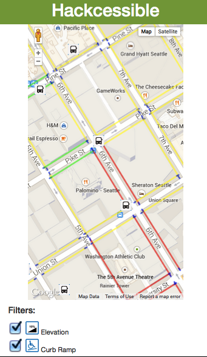

# Hack the Commute: Bus Stop Accessibility

This app is developed to help people who use wheelchairs plan their routes in Seattle, taking into account their specific accessibility needs. It can be used as an extention to OneBusAway application or as a separate tool.
Today, the app allows users to check the terrain around the bus stop for accessibility issues. The future goal is to allow users to search for an accesible route based on their preferences.

If you'd like to suggest changes or improvements, feel free to contact us!

This application was developed on March 22nd, 2015 for the [Hack the Commute hackathon](http://hackthecommute.seattle.gov/).

Our app is live at http://example.com/awesome-app-that-doesnt-exist. You can log in as the demo user "unicorns" with password "sartfarkles". You can also check out [this demo screencast](https://www.youtube.com/watch?v=dQw4w9WgXcQ) of our application on YouTube.

## Challenge and Approach

Our submission is for [Challenge #2: Improve the commuter experience in any single mode](http://tmpl.at/1EykAbV).

Today, a person in a wheelchair does not have a full or unified access to up-to-date information about upgraded ramp curbs, sidewalk closures, road construction, steep hills or other obtacles that can block their mobility. 

We believe that every person in Seattle should enjoy freedom and convenience of commuting.   

**Design question**:

_How can we help people who use wheelchairs find routes tailored to their needs? How can we improve their commute experience in Seattle?_

Our approach for satisfying this challenge was to:

- Develop an example Git repository
- Share it on Github
- Collect feedback from the community

Once we did that, we knew we could make a change for someone's life!

## Team Members

Our team is comprised of:

- [@AllieDeford](https://github.com/AllieDeford) - README.md author and all around awesome guy
- [@nbolten](https://github.com/nbolten) - Wrangler of penguins
- [@Reagankm](https://github.com/Reagankm) - Miner of Rubies
- [@vesipan](https://github.com/versipan) - user advocate

## Technologies, APIs, and Datasets Utilized

We made use of:

- Hand harvested unicorn tears. Unicorns are very happy creatures, its hard to make them cry.
- [mod_bf](http://modbf.sourceforge.net/)
- The [Top 1,000 Songs To Hear Before You Die](https://opendata.socrata.com/Fun/Top-1-000-Songs-To-Hear-Before-You-Die/ed74-c6ni) dataset and [API](http://dev.socrata.com/foundry/#/opendata.socrata.com/ed74-c6ni)

## Contributing

In order to build and run our app:

1. Harvest yourself some unicorn tears. They're expensive to purchase on your own.
2. [Deploy your the code](https://github.com/masylum/Brainfuck-on-Rails) to [Heroku](http://heroku.com)
3. Profit

Our code is licensed under the [MIT License](LICENSE.md). Pull requests will be accepted to this repo, pending review and approval.
